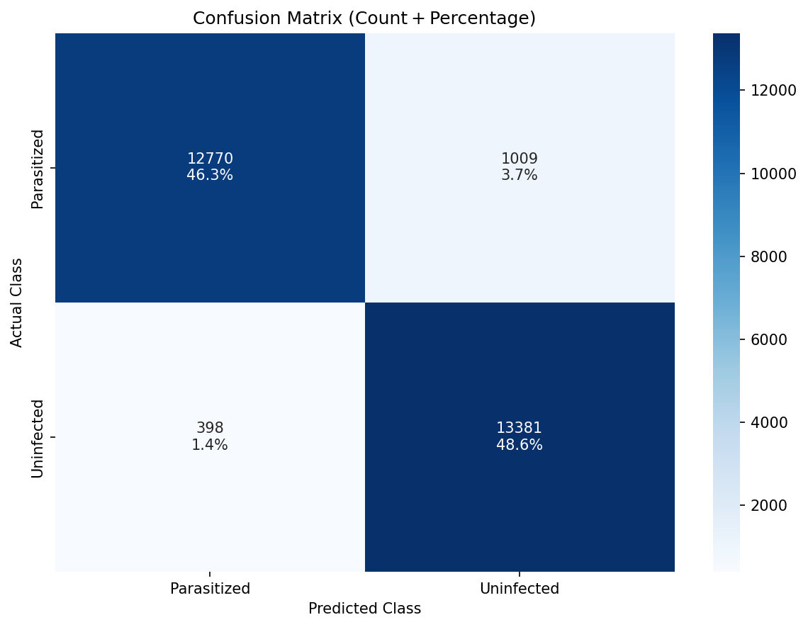
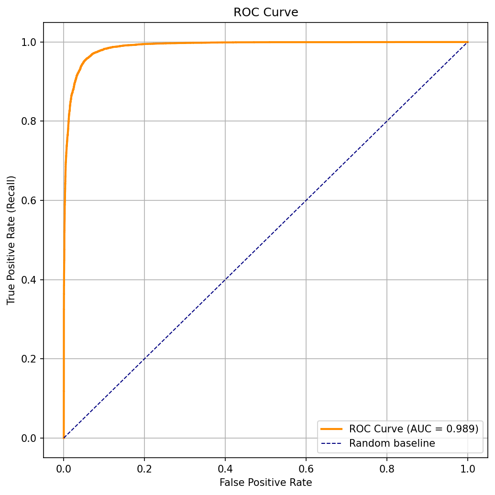
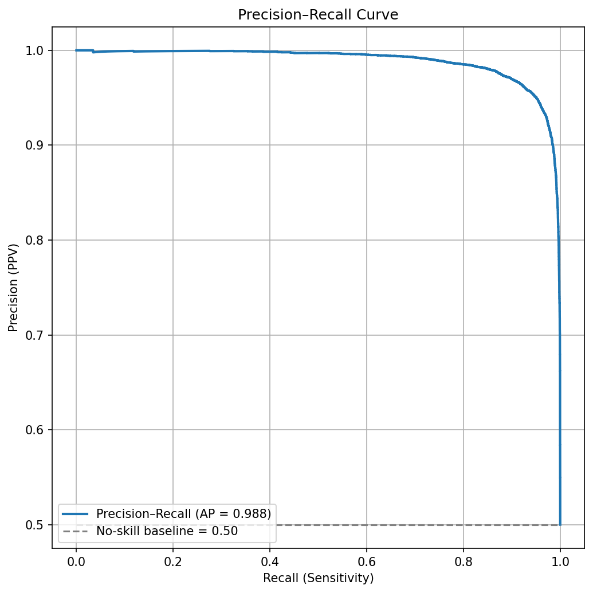

<div dir="rtl">

# 🧠 پروژه تشخیص مالاریا با استفاده از شبکه‌های عصبی کانولوشنی (CNN)

## معرفی پروژه

هدف این پروژه، طراحی و پیاده‌سازی یک سیستم تشخیص خودکار مالاریا با استفاده از تصاویر میکروسکوپی سلول‌های خونی است. در این پروژه از مدل‌های یادگیری عمیق و به‌طور خاص معماری VGG16 به صورت از ابتدا (from scratch) برای طبقه‌بندی سلول‌های آلوده و غیرآلوده استفاده شده است.

داده‌های مورد استفاده در این پروژه از مجموعه‌داده **[Malaria Cell Images Dataset](https://www.kaggle.com/datasets/iarunava/cell-images-for-detecting-malaria)** موجود در پلتفرم Kaggle استخراج شده‌اند.

---

## 📂 ساختار پروژه

```
.
├── data/
│   └── cell_images/
│       ├── Parasitized/
│       └── Uninfected/
├── images/
│   ├── confusionmatrix.png
│   ├── roccurve.png
│   └── percisioncurve.png
├── notebooks/
│   ├── training.ipynb
│   └── evaluation.ipynb
├── models/
│   └── best_model.keras
├── reports/
│   └── metrics_report.txt
└── README.md
```

---

## ⚙️ مراحل انجام پروژه

### ۱. پیش‌پردازش داده‌ها

- بارگذاری تصاویر با اندازه ۱۲۸x۱۲۸ پیکسل
- نرمال‌سازی داده‌ها با استفاده از `rescale=1./255`
- تقسیم مجموعه‌داده به دو بخش آموزش و اعتبارسنجی با نسبت ۸۰/۲۰

```python
from tensorflow.keras.preprocessing.image import ImageDataGenerator

datagen = ImageDataGenerator(rescale=1./255, validation_split=0.2)
train_data = datagen.flow_from_directory('data/cell_images',
                                         target_size=(128, 128),
                                         class_mode='binary',
                                         subset='training')
val_data = datagen.flow_from_directory('data/cell_images',
                                       target_size=(128, 128),
                                       class_mode='binary',
                                       subset='validation')
```

---

### ۲. آموزش مدل شبکه عصبی

از معماری VGG16 بدون استفاده از وزن‌های پیش‌آموزش‌دیده استفاده شده و لایه‌های Fully Connected جدید به مدل اضافه گردیده است.

```python
from tensorflow.keras.applications import VGG16
from tensorflow.keras.models import Sequential
from tensorflow.keras.layers import Dense, Dropout, Flatten

base_model = VGG16(include_top=False, weights=None, input_shape=(128, 128, 3))
model = Sequential([
    base_model,
    Flatten(),
    Dense(256, activation='relu'),
    Dropout(0.5),
    Dense(1, activation='sigmoid')
])
model.compile(optimizer='adam', loss='binary_crossentropy', metrics=['accuracy'])
```

---

### ۳. ارزیابی عملکرد مدل

پس از آموزش مدل، عملکرد آن با استفاده از معیارهای ارزیابی کلاس‌بندی اندازه‌گیری شد. نمودارهای زیر نتایج ارزیابی مدل را به تصویر می‌کشند.

#### 📉 Confusion Matrix



این نمودار نشان‌دهنده تعداد پیش‌بینی‌های درست و نادرست برای دو کلاس «آلوده» و «غیرآلوده» است. دقت بالا در این نمودار نشان‌دهنده توانایی مدل در افتراق دقیق بین سلول‌های سالم و آلوده است.

#### 📈 ROC Curve



این نمودار رابطه بین True Positive Rate و False Positive Rate را نمایش می‌دهد. مساحت زیر منحنی (AUC) بالا نشان‌دهنده عملکرد بسیار خوب مدل در تشخیص است.

#### 📊 Precision–Recall Curve



این نمودار عملکرد مدل را در سطوح مختلف آستانه تصمیم‌گیری به تصویر می‌کشد. نزدیکی منحنی به گوشه بالا-راست نشان‌دهنده توازن خوب بین دقت و یادآوری است.

---

## 📋 گزارش عددی عملکرد مدل

```text
Accuracy:  0.9489
Precision: 0.9299
Recall:    0.9711
F1 Score:  0.9501
Matthews Correlation Coefficient (MCC): 0.8988
```

### Classification Report

```text
               precision    recall  f1-score   support

 Parasitized       0.97      0.93      0.95     13779
  Uninfected       0.93      0.97      0.95     13779

    accuracy                           0.95     27558
   macro avg       0.95      0.95      0.95     27558
weighted avg       0.95      0.95      0.95     27558
```

این گزارش نشان می‌دهد که مدل در تشخیص هر دو کلاس عملکرد متعادلی دارد. مقدار MCC بالا نیز نشان‌دهنده توانایی مدل در تمایز دقیق بین کلاس‌ها است، حتی در شرایط عدم تعادل احتمالی.

---

## 📌 نتیجه‌گیری

پروژه حاضر یک سامانه‌ی دقیق، سریع و مبتنی بر یادگیری عمیق را برای شناسایی مالاریا از طریق تصاویر سلولی ارائه می‌دهد. نتایج عددی و تصویری مدل نشان‌دهنده دقت بالا و کارایی مناسب در تشخیص سلول‌های آلوده و غیرآلوده هستند.

</div>
